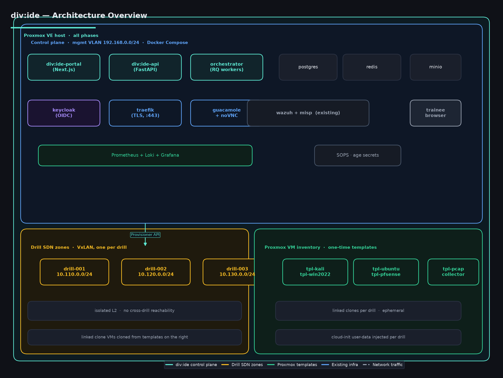

# div:ide — Cyber Drill Platform

## Design & Architecture Plan

> **Status:** Phase 0 — Foundations **DONE**. Stages 2, 2.5, 2.7, 3, 4, 5, 6, 7, 8, 9, 10, 11, 12, 13, 14, 15, 16, 17, 18 **DONE**. F1 (portal role-aware UI cards) **DONE**. F2 (L2 closure: CORS, rate-limit, watchdog, telemetry, after-action report) **DONE**. F3-F8 (cyber-range §15 plans) **DONE**.
> **Phase 1 — One-VM drill end-to-end ✅ CLOSED** (run #11, status=`succeeded`, VMID 109 cloned from `tpl-debian-cloudinit`, audit populated, asset teardown to `stopped`).
> **Phase 2 — LAN-grade cyber drill platform ✅ CLOSED** — L1 ledger 9/9 ✅, L2 ledger 18/18 ✅ (closed by F2). L3 ledger 3/11 partially; cyber-range gaps documented in §15.
> **§15 — Cyber-range plans ✅ ALL CLOSED** — F3 (multi-VM asset spawning), F4 (noVNC console), F5 (flags + scoring), F6 (multi-team exercises + leaderboard), F7 (range templates + reset), F8 (SOC view + SSE telemetry).
> **§17 — Roadmap (post-§15) ✅ REVISED** — five final-product pillars (R1 Redis multi-worker, F9 DrillConsole consolidation, F10 onboarding wizard, F11 debrief artifact, F12 product packaging). Detail in §18.
> **§7 — Drill Lifecycle** ✅ UPDATED — replaced aspirational `DRAFT→SCHEDULED→PROVISIONING→LIVE` flow with the actual shipped state machines (Run: pending→running→terminal; Exercise: idle→live→ended→archived).
> `make preflight` 9/9 READY. **431 root + 428 API = 859 tests passing** (3 pre-existing unrelated CLI auth failures).
> See **[docs/TEST-PRODUCT.md](TEST-PRODUCT.md)** for L1/L2/L3 "test product" criteria and ETA per level; **§15 (below)** for the cyber-range roadmap that sits on top of L3.
> **Target platform:** Proxmox VE (main host).
> **Control plane runtime:** Docker Compose on a dedicated VM/LXC.
> **Repo root:** `/DATA/Storage/docker/divide-cyber-drill`

---

## 0. Visual Architecture Map

The diagrams below illustrate how div:ide is composed at every phase. Regenerate them with:

```bash
python3 tools/gen_diagrams.py   # writes docs/images/*.png
```

| Diagram | Description |
|---|---|
| [`images/00-overview.png`](images/00-overview.png) | End-state view: control plane, drill SDN zones, Proxmox VM inventory |
| [`images/01-phase0-foundations.png`](images/01-phase0-foundations.png) | **Phase 0** — minimal runnable skeleton, control plane + Proxmox API client |
| [`images/02-phase1-one-vm-drill.png`](images/02-phase1-one-vm-drill.png) | **Phase 1** — single Ubuntu drill VM (vsftpd 2.3.4), Wazuh auto-enroll |
| [`images/03-phase2-multi-vm-sdn.png`](images/03-phase2-multi-vm-sdn.png) | **Phase 2** — multi-VM drills in isolated VxLAN zones |
| [`images/04-phase3-telemetry-reports.png`](images/04-phase3-telemetry-reports.png) | **Phase 3** — Wazuh correlation + MISP publishing + PDF after-action reports |
| [`images/05-phase4-polish.png`](images/05-phase4-polish.png) | **Phase 4** — RBAC via Keycloak, scheduled drills, scenarios marketplace |



---

## 1. Vision

**div:ide cyber drill** is a self-hosted, Proxmox-backed cyber range / drill platform that lets a blue team, red team, or training cohort:

- Spin up **isolated, reproducible attack/defense scenarios** on demand.
- Launch scenarios as **isolated VMs** (Kali attacker, victim Linux/Windows, vulnerable services) inside Proxmox.
- Stream telemetry to **Wazuh** (already deployed) and tag indicators in **MISP** (already deployed).
- Run scheduled drills, capture artifacts, and produce **after-action reports**.

The platform is **not** a CTF engine and **not** a public cloud range — it's a private, org-internal drill orchestrator with strong isolation between the *control plane* (div:ide itself) and the *exercise network* (drill VMs).

Naming rationale: **div:ide** = "divide" — the act of segmenting networks, dividing red from blue, and isolating blast radius.

---

## 2. Top-Level Architecture

```
┌─────────────────────────────────────────────────────────────────────────┐
│                          Proxmox VE (main host)                        │
│                                                                         │
│  ┌─────────────────────── Control Plane (Docker, mgmt VLAN) ──────────┐ │
│  │  div:ide-portal │ div:ide-api │ div:ide-orchestrator │ postgres   │ │
│  │  keycloak       │ minio       │ wazuh-* (existing)   │ misp (ex.) │ │
│  └───────────────────────────────────────────────────────────────────┘ │
│                                                                         │
│  ┌─────────────────────── Drill Networks (Proxmox SDN/VLAN) ──────────┐ │
│  │  Range A: blue-team-net ──┐                                         │
│  │  Range B: red-team-net  ──┼── vnets/segments, isolated per drill   │
│  │  Range C: target-net    ──┘                                         │
│  └───────────────────────────────────────────────────────────────────┘ │
│                                                                         │
│  ┌─────────────────────── Proxmox VM/CT inventory ─────────────────────┐│
│  │  Templates: tpl-kali, tpl-win11-vuln, tpl-ubuntu-srv, tpl-pfsense  ││
│  │  Cloned per drill via cloud-init + linked clones                    ││
│  └───────────────────────────────────────────────────────────────────┘ │
└─────────────────────────────────────────────────────────────────────────┘
```

Three logical layers, all sitting on one Proxmox host (later: a cluster):

1. **Control Plane** — div:ide services + existing Wazuh/MISP. Lives on a *management* network that drill VMs cannot reach directly.
2. **Drill Networks** — per-drill or per-range SDN zones. Created/destroyed by div:ide via Proxmox API.
3. **Workload VMs** — the actual Kali, Windows, Linux, firewall VMs cloned from templates.

---

## 3. Tech Stack

| Concern | Choice | Why |
|---|---|---|
| Orchestration backend | **Proxmox VE 8.x** | Already your hypervisor; rich REST API; supports cloud-init, SDN, snapshots, linked clones |
| Control plane runtime | **Docker Compose** (v2) on a Debian/PVE VM or LXC | Matches your existing stacks (wazuh-docker, misp-docker) |
| Frontend | **Next.js (React, TypeScript)** | Fast iteration, good for forms/dashboards; SPA deployed via `nginx` container |
| API | **FastAPI (Python 3.12)** | Async, OpenAPI auto-generated, easy Proxmox client integration |
| Database | **PostgreSQL 16** | Drill definitions, runs, users, audit log |
| Cache / queue | **Redis** | Job queue for provisioning tasks (RQ/Celery-free, simple) |
| Object storage | **MinIO** | Drill artifacts (PCAPs, screenshots, logs, reports) |
| Identity | **Keycloak** (OIDC/SAML) | SSO, RBAC (admin / lead / blue / red / observer) |
| VM provisioning | **proxmoxer** (Python) + `qm cloud-init` | Native API client |
| VM console access | **noVNC + Apache Guacamole** in Docker | Browser-based, no client install for trainees |
| Telemetry / SIEM | **Wazuh** (existing stack) | Agent-based + syslog ingest from drill VMs |
| Threat intel | **MISP** (existing stack) | Auto-publish IOCs extracted from drill runs |
| Observability of div:ide itself | **Prometheus + Grafana + Loki** | Standard, lightweight |
| Secrets | **SOPS** + age, mounted | Avoid hard-coded creds |
| IaC | **Ansible** playbooks for VM post-provision config | Repeatable drill prep |

---

## 4. Repository Layout

```
divide-cyber-drill/
├── README.md
├── docs/
│   ├── PLAN.md                  # this document
│   ├── ARCHITECTURE.md          # diagrams, network map
│   ├── DRILL-LIFECYCLE.md       # state machine
│   ├── SECURITY-MODEL.md        # isolation, blast radius
│   └── RUNBOOKS/                # operator guides
├── deploy/
│   ├── docker-compose.yml       # control-plane services
│   ├── docker-compose.observability.yml
│   ├── .env.example
│   └── traefik/                 # reverse proxy + TLS
├── services/
│   ├── api/                     # FastAPI
│   │   ├── app/
│   │   │   ├── main.py
│   │   │   ├── routers/
│   │   │   ├── core/
│   │   │   ├── models/
│   │   │   ├── schemas/
│   │   │   └── services/
│   │   ├── tests/
│   │   ├── pyproject.toml
│   │   └── Dockerfile
│   ├── orchestrator/            # background workers (RQ)
│   ├── portal/                  # browser portals
│   │   ├── index.html           # /portal/ setup wizard (vanilla)
│   │   └── app/                 # /portal/app/ user portal (React/Vite)
│   │       ├── src/             #    TypeScript + React components
│   │       ├── package.json
│   │       ├── vite.config.ts
│   │       └── build/           #    gitignored output
│   └── guacamole/               # noVNC/Guac stack (Phase 2+)
├── proxmox/
│   ├── terraform-templates/     # cloud-init snippets
│   ├── vm-templates/            # Packer/import scripts for tpl-*
│   ├── sdn/                     # zone/vnet definitions
│   └── ansible/
├── scenarios/
├── tools/
│   ├── gen_diagrams.py          # architecture diagram generator
│   └── report-builder/          # builds PDF AAR from artifacts
├── tests/
└── .github/
    └── workflows/
```

---

## 5. Core Components

### 5.1 div:ide-api (FastAPI)

- REST + WebSocket.
- Endpoints: `/healthz`, `/readyz`, `/api/v1/{scenarios,drills,proxmox}`.
- Phase 0: stubs only. Phase 1+ implements real behavior.
- RBAC: admin, drill-lead, blue, red, observer.
- Audit log: every API call written to Postgres + shipped to Wazuh.

### 5.2 div:ide-orchestrator (workers)

- Pulls provisioning jobs from Redis queue.
- Steps for a drill:
  1. Reserve Proxmox resources (CPU/RAM/storage pool).
  2. Create SDN zone / VNet for the drill.
  3. Clone VMs from templates (linked clone, fast).
  4. Apply cloud-init user-data.
  5. Boot, wait for `cloud-init` done signal.
  6. Run Ansible playbooks to install scenario services / vulnerabilities.
  7. Register Wazuh agents.
  8. Start PCAP collector sidecar on a span port.
  9. Notify portal via WebSocket.
  10. Schedule teardown (TTL or manual).

### 5.3 div:ide-portal (Next.js) — Phase 1+

- Pages: Dashboard, Scenarios, Drills (live), Reports, Admin, Audit.
- Live console: embeds noVNC iframe from Guacamole.

### 5.4 Scenario Engine — Phase 1+

A drill is described declaratively (see [`scenarios/`](../../scenarios/) for the schema once it lands).

---

## 6. Proxmox Integration (gated behind credentials)

### 6.1 Templates (built in Phase 1+)

| VMID | Name | Notes |
|---|---|---|
| 9000 | `tpl-kali` | cloud-init, qemu-guest-agent |
| 9001 | `tpl-win2022` | Sysmon + Wazuh agent |
| 9003 | `tpl-ubuntu-2204` | cloud-init, vulnerable service profiles per scenario |
| 9004 | `tpl-pfsense` | OVA import |
| 9005 | `tpl-tinycore` | PCAP collector |

Linked clones from a template take ~5–15 s vs. full clone ~1–3 min.

### 6.2 Cloud-init (Phase 1+)

Each drill VM gets a unique `ciuser` / `sshkeys`, plus per-scenario `user-data` baked by the orchestrator.

### 6.3 Networking (Phase 2+)

Proxmox SDN with VxLAN zones, one per drill. Control-plane bridge is *not* attached to any drill VNet.

### 6.4 Quotas & Safety

- Per-drill resource cap (default: 4 vCPU / 8 GB RAM / 50 GB disk).
- Hard TTL: drills auto-teardown after N hours (default 4 h, max 24 h).
- Pre-drill guard: refuse if remaining host capacity < 25%.

---

## 7. Drill Lifecycle (state machines)

The platform has **two** state machines: one for a single-team
`Run` (the F1-F8 path) and one for a multi-team `Exercise`
(introduced in F6). The diagram below was never shipped; the
shipped state machines are described in §7.1 and §7.2.

### 7.1 Run state machine (single-team, F1-F8)

```
PENDING ──worker pick──> RUNNING ──terminal──> (SUCCEEDED | FAILED | TIMEOUT | CANCELLED)
```

Transitions (enforced in `app/db/models.py::RunStatus`):

  * `pending → running` — the worker picks up the run; the
    runner begins cloning assets.
  * `running → succeeded` — every asset reached `running` AND
    the runner's win conditions evaluated to `pass` for the
    declaring team.
  * `running → failed` — an unrecoverable error (PVE clone
    5xx, asset boot timeout, etc.); the runner records the
    cause in `runs.error`.
  * `running → timeout` — the run exceeded the scenario's
    `duration_min` (default 30 m; max 24 h).
  * `running → cancelled` — the operator POSTed
    `/api/v1/drills/{id}/stop` (or the API received a `SIGTERM`
    during teardown). Cancellation is **cooperative** — the
    runner marks the run `cancelled` and tears down assets in
    the background.

Every transition appends to `audit_log` (polymorphic FK with
`ON DELETE SET NULL`) and emits a `TelemetryEvent` for the
SSE bus (§7.3 below).

### 7.2 Exercise state machine (multi-team, F6)

```
IDLE ──start──> LIVE ──stop──> ENDED ──reopen──> LIVE
  │              │              │
  └──────────────┴──────────────┴── archive ──> ARCHIVED
```

Transitions (enforced in `app/db/models.py::ExerciseStatus.can_transition`):

  * `idle → live` — operator POSTs `/api/v1/exercises/{id}/start`;
    per-team `Run`s are spawned in parallel; the leaderboard
    becomes live.
  * `live → ended` — operator POSTs `/api/v1/exercises/{id}/stop`,
    OR the exercise's `scheduled_end_at` passes; the leaderboard
    freezes; teams can no longer submit flags.
  * `ended → live` — operator reopens a paused exercise (re-starts
    the timer + un-freezes scoring); useful for partial-class
    rehearsals.
  * `any → archived` — admin POSTs `/api/v1/exercises/{id}/archive`;
    the exercise becomes a frozen snapshot for post-mortem.

Single-team `Run`s bypass this state machine entirely: a `Run`
created without an `Exercise` is the F5-and-earlier flow, with
its own `pending → running → (terminal)` progression.

### 7.3 Telemetry fan-out (F8)

Both state machines emit events through `app/services/event_bus/`:

  * `run.started` (severity: info) — every Run transition into
    `running`.
  * `asset.running` (severity: info) — every asset reaches
    `running`.
  * `flag.captured` (severity: warn) — a team submitted a flag
    that matches a planted one.
  * `kill-chain.signal` (severity: critical) — runner-emitted
    custom event for blue-team SOC view.
  * `run.completed` (severity: info) — every Run transition into
    a terminal state, with the terminal state in the payload.

The `EventBus` protocol has two implementations: `InProcessEventBus`
(default, single-worker) and `RedisEventBus` (set `REDIS_URL` +
`DIVIDE_EVENT_BUS=redis`; cross-worker fan-out for multi-worker
uvicorn deployments — see §18 R1).

SSE consumers connect to `GET /api/v1/runs/{id}/events/stream` and
filter by `run_id` client-side. The portal `SocViewCard` is the
canonical consumer.

### 7.4 Why two state machines (not one)

The original §7 proposed a single `DRAFT → SCHEDULED →
PROVISIONING → LIVE` flow that conflated exercise scheduling with
run execution. In practice the platform grew:

  * **Single-team drill (F1-F5)** — one Run, scheduled ad-hoc
    via `POST /api/v1/drills`. No scheduling horizon; no
    per-team coordination. Simple `RunStatus` FSM is enough.
  * **Multi-team exercise (F6)** — N teams, scheduled start/end,
    leaderboard, parallel Runs on the same scenario topology.
    Needs its own FSM for the *coordinator* lifecycle, with
    the `RunStatus` FSM nested per team.

The two FSMs share the `TelemetryEvent` bus (§7.3) so the SOC
view sees events from both paths uniformly.

Persisted as `runs.status` and `exercises.status` in Postgres.
Every transition appends to `audit_log` (polymorphic FK with
`ON DELETE SET NULL`) and forwards a `TelemetryEvent` to the
EventBus. Wazuh integration (Phase 3) will subscribe to the
same bus rather than poll Postgres.

---

## 8. Integration with Existing Stacks

### 8.1 Wazuh (Phase 1+)

A Wazuh agent group per drill (e.g. `drill-<id>`). div:ide-api creates/deletes the group via Wazuh API when a drill starts/ends.

### 8.2 MISP (Phase 3+)

On drill completion, report-builder extracts IOCs (IPs, domains, URLs, hashes) from PCAPs and pushed them to MISP as an event tagged `drill:<id>` and `tlp:amber`.

---

## 9. Security Model

| Boundary | Control |
|---|---|
| Internet ↔ div:ide control plane | Traefik with TLS + fail2ban; only 443/80 exposed |
| Control plane ↔ Proxmox API | Internal network, token auth, scoped Proxmox user |
| Control plane ↔ drill VMs | Routed telemetry VLAN, egress-only firewall |
| Drill VM A ↔ Drill VM B | Separate SDN VxLAN zones — L2 unreachable |
| Drill VM ↔ Internal corporate LAN | Default deny; explicit allowlist |
| Secrets | Age-encrypted `.env` + SOPS; never committed |

---

## 10. Operational Concerns

- **Backups:** Proxmox PBS backs up templates nightly. Drill VMs are ephemeral; their artifacts land in MinIO with lifecycle rule (cold after 30 d, delete after 180 d).
- **Capacity planning:** A typical 4-VM drill ≈ 8 vCPU / 16 GB RAM. On the current 12 GB / 8-core VM you can run at most 1 such drill; on the main Proxmox host target 3–5 concurrent drills.
- **Cost in time:** End-to-end drill boot target: < 3 min from "Start" to "All VMs reachable".

---

## 11. Roadmap

**Phase 0 — Foundations** ✅
- Plan + architecture diagrams
- Docker Compose control plane (api, postgres, redis, minio, traefik)
- FastAPI skeleton with `/healthz`, `/readyz`, stub routers
- CI, pre-commit, devcontainer, 6 architecture diagrams

**Stage 2 — Read-only Proxmox** ✅
- 4 read-only endpoints: `/api/v1/proxmox/{health,nodes,storage,templates}`
- TTL cache (5 min), clean error mapping (200/502/503)
- `docs/PROXMOX-SETUP.md` walks through user/token/permission setup
- **Blocked on user's PVE token fix — endpoints return 502 with descriptive errors.** Code is solid; live auth is the gate.

**Stage 2.5 — Scenario spec** ✅
- JSON Schema (`schemas/scenario.schema.json`, `divide/v1`, draft 2020-12)
- 2 reference scenarios (`phish-to-ransom`, `lateral-movement-baseline`)
- `tools/validate_scenario.py` CLI + `make validate-scenarios`
- `docs/SCENARIO-SPEC.md` author-facing prose
- Pre-commit hook + CI step enforce validation

**Stage 2.7 — DB models + migrations** ✅
- 4 tables: `scenarios`, `runs`, `assets`, `audit_log` (+ enums)
- Polymorphic AuditLog (FKs with `ON DELETE SET NULL`)
- `alembic.ini` + first migration (hand-written, audited)
- Live migration verified against dev Postgres (5 tables created)
- 15 model tests + 5 alembic tests

**Stage 3 — Runner + drills** ✅
- Adapter interface for Proxmox (`ProxmoxAdapter`) with `RealProxmoxAdapter` + `MockProxmoxAdapter`
- End-to-end happy path: YAML → DB Run row → DB Asset rows → mock clone → DB status transitions
- `POST /api/v1/drills` + `POST /api/v1/drills/{id}/stop` + `GET /api/v1/drills` wired
- Smoke script: `python tools/run_smoke.py examples/scenarios/phish-to-ransom.scenario.yaml`
- **Strict** lifecycle model (runner owns full VM lifecycle end-to-end)
- 14 runner tests
- Live verified: failed Run row + audit events written to dev Postgres

**Stage 4 — Scenario sync + catalog API** ✅
- `app/services/scenario_sync.py` — sync YAML files → DB rows (idempotent, schema-validated, soft-archive on YAML removal)
- `app/routers/scenarios.py` — full CRUD: GET (list with `include_archived`), GET by name, POST (yaml or path), DELETE (archive), POST `/{name}/restore`
- Auto-sync on API startup (opt-out via `DIVIDE_SYNC_ON_STARTUP=false`)
- `tools/sync_scenarios.py` CLI + `make sync-scenarios` (runs migrations then sync; `--no-archive` flag)
- `archived_at` column on `scenarios` (migration `0002`)
- `Scenario` router checks: 400 (bad input), 409 (missing name), 422 (validation), 404 (not found), 410 Gone (archived)
- `Drill` router checks archived before starting: 410 Gone for archived scenario
- `_find_schema()` supports dev + container layouts + env override
- Dockerfile: build context is repo root, schemas/ bundled into image
- docker-compose: repo mounted read-only into `/workdir`, scenarios env vars
- 18 sync tests + 3 schema-resolution tests
- Live verified: 2 scenarios synced on first API boot, all 4 endpoints work, archive/restore round-trip works

**Stage 5 — RealProxmoxAdapter + live-PG tests** ✅
- `app/runners/real_adapter.py` — `RealProxmoxAdapter` implementing the existing `ProxmoxAdapter` ABC via `proxmoxer` (sync, bridged through `asyncio.to_thread` + per-call timeout)
- Mapping: list_nodes / find_template / allocate_vmid / clone_vm / start_vm / stop_vm / destroy_vm / get_vm_state — all against the live PVE REST endpoints
- `from_settings(cls, p)` classmethod pulls auth from `app.core.config.ProxmoxSettings`
- `destroy_vm` is idempotent on 404 (PVE "no such VM" → swallowed so teardown can re-run safely)
- Errors from proxmoxer wrapped as `ProxmoxAPIError`; timeouts surface as `ProxmoxAPIError` (never `asyncio.TimeoutError` to the runner); 403s get a clear PVEVMAdmin ACL hint
- `app/runners/runner.py` `_default_adapter()` + `build_runner()` factory: env-gated real ↔ mock swap, no code change needed to flip
- `app/runners/__init__.py` re-exports both adapters, factory, and dataclasses for ergonomic imports
- Live-PG test infra: `pytest.mark.live_pg` marker + `DIVIDE_TEST_LIVE_PG` env var; `make test-live-pg` target; opt-in CI job (`live-pg-tests`) with Postgres service container
- 34 real_adapter tests (mocked proxmoxer, no live PVE required) + 3 live_pg plumbing tests
- Tests: 89 → 125 passing (+36). Default run still SQLite + mock; live mode is opt-in

**Stage 6 — First-live-drill bootstrap** ✅
- `tools/upload_cloudinit_template.py` — connects to PVE via proxmoxer, creates a VM with scsi0 + cloudinit drive + install ISO, marks `template=1`. Idempotent on `--name` (existing template short-circuits with exit 0). `--convert-only VMID` flips an existing VM to a template.
- `tools/live_drill.py` — POSTs `/api/v1/drills` for a named scenario, polls `/api/v1/drills` every 2s until terminal, prints final state. `--list-only` mode for inspection.
- `examples/scenarios/first-live-drill.scenario.yaml` — single Debian cloud-init VM using template `tpl-debian-cloudinit`. Schema-valid, minimal. Designed to be the first end-to-end live drill.
- `RealProxmoxAdapter._call` now augments 403 errors with an ACL hint ("token needs PVEVMAdmin on /v2/vm; see PROXMOX-SETUP.md §6").
- Makefile targets: `make upload-template NAME=... ISO=...` and `make live-drill SCENARIO=... TIMEOUT=...`.
- 6 new tests for live_drill JSON-shape tolerance + terminal-state detection.
- Tests: 125 → 131 (+6).
- **Status:** ready. Final gate is the user granting PVEVMAdmin on `/v2/vm` for `divide@pve@pam` from PVE, then running `make upload-template` + `make live-drill`.

**Stage 7 — Drill cancellation** ✅
- `Runner.cancel_run(run_id, reason=, actor=, session=)` — trainee-initiated abort. Validates run is `PENDING`/`RUNNING` (else `RunnerError`). Best-effort stop + destroy every spawned asset (uses `force=True` so half-broken VMs still tear down). Sets `Run.status=CANCELLED`, `ended_at`, `error=reason`. Writes `RUN_CANCELLED` audit with reason + actor in details.
- `POST /api/v1/drills/{run_id}/cancel` — optional body `{reason?, actor?}`. Returns 200 on success, 404 if run missing, 409 if run is already terminal. Response shape: `{run_id, status, reason, assets}`.
- `Runner.stop_run` semantics clarified in docstring (operator-initiated → `SUCCEEDED`); `cancel_run` is the trainee path → `CANCELLED`. Two distinct terminal states, same teardown code.
- `drills` router no longer hard-codes `MockProxmoxAdapter()` — now uses `build_runner()`, so the API automatically uses `RealProxmoxAdapter` when `PROXMOX_*` env is set (previously this would have silently broken the first live drill even though the runner was correct).
- 9 new tests (6 runner cancel paths + 3 router cancel paths).
- Tests: 131 → 140 (+9). Live verified: `POST /drills/1/cancel` returns 409 for already-terminal runs, 404 for missing.

**Stage 8 — Prometheus observability** ✅
- `app/observability/__init__.py` — registry + named counters/gauges/histograms. Module-level `_zero_init()` pre-creates label combinations so `/metrics` is non-empty from first scrape (avoids Prometheus `rate()` returning NaN).
- `app/observability/middleware.py` — `PrometheusMiddleware` records `divide_http_requests_total{method,route,status}` and `divide_http_request_latency_seconds{method,route}` on every request. Skips `/metrics` itself. Handles FastAPI's quirk where `@router.get("", ...)` yields `route.path == ""` (normalized to `/`).
- `GET /metrics` endpoint returns Prometheus 0.0.4 exposition format (`text/plain; version=1.0.0`).
- Hooked metrics into Runner: `inc_run_started` on every `start_run`; `inc_run_terminal` on `SUCCEEDED`/`FAILED`/`CANCELLED`; `record_cancel(result=ok|not_found|already_terminal|error)` in router.
- Pre-existing test ordering flake fixed in `tests/conftest.py::client` fixture (resets `_engine`, `_session_maker`, and `get_settings.cache_clear()`).
- `prometheus-client>=0.21.0` added to `pyproject.toml` and `Dockerfile`.
- 9 new tests. Tests: 140 → 149.
- Live verified: `GET /metrics` returns 12 metric families, cancel counters populate correctly.

**Stage 9 — Prometheus + Grafana wiring** ✅
- `prometheus` service added to `deploy/docker-compose.yml` (port 9090). Scrapes `api:8000/metrics` every 15s. 15-day retention.
- `grafana` service added (port 3000). Default login `admin` / `divide`. Mounts provisioning + dashboards from the repo (read-only).
- `deploy/prometheus/prometheus.yml` — single scrape job for the API.
- `deploy/grafana/provisioning/datasources/prometheus.yml` — registers Prometheus as the default datasource.
- `deploy/grafana/provisioning/dashboards/divide.yml` — auto-loads the starter dashboard from `/var/lib/grafana/dashboards`.
- `deploy/grafana/dashboards/divide-drill-platform.json` — 6-panel starter dashboard: run rate by outcome, active runs, cancel requests donut, HTTP latency percentiles (p50/p95/p99), HTTP request rate by status, latency heatmap.
- `docs/OBSERVABILITY.md` — full operator doc: metric reference, useful PromQL queries, how to add panels, production hardening notes.
- `GRAFANA_ADMIN_USER` / `GRAFANA_ADMIN_PASSWORD` added to `.env.example`.
- 5 deploy-config tests (parse prometheus.yml, datasource provisioning, dashboard provider, dashboard JSON, compose service mentions).
- Tests: 149 → 154 (+5). Live verified: Prometheus reports `divide-api` as `up`, Grafana loads the dashboard, datasource proxy returns query results.

**Stage 10 — Phase 1 prep tooling** ✅
- `tools/preflight.py` — 8-check pre-flight gate (API health, PROXMOX config, PVE nodes, template, scenario, /metrics, Prometheus scrape, Grafana dashboard). Returns exit 0 only if every check passes; on FAIL prints an actionable hint.
- `tools/watch_drill.py` — Prometheus-driven watcher. Exits the moment `divide_runs_total{outcome=X}` increases. Has `--api-poll` fallback and `--cancel-after N` mode for exercising the cancel endpoint mid-flight.
- Makefile targets: `preflight`, `watch-drill`, `live-cancel` (the runbook one-liner for the cancel exercise).
- `docs/LIVE-DRILL-RUNBOOK.md` — 396-line operator doc: prerequisites, PVE ACL grant, env check, preflight, template upload (with the qemu-guest-agent gotcha), drill run, Grafana verification, cancel exercise, full troubleshooting matrix.
- 9 new tests (5 preflight + 4 watch_drill). Tests: 154 → 163 (+9).
- Live verified against current stack: preflight reports 7/8 (template is the one expected FAIL).

**Stage 11 — ACL docs + preflight check** ✅
- `pveum acl modify` flags corrected in two docs: `--userid` → `--users`, `--role` → `--roles`. The old forms were rejected by PVE 8+/9 with "Unknown option: userid".
- Added PVE-version note to both `docs/LIVE-DRILL-RUNBOOK.md` and `docs/PROXMOX-SETUP.md` §8 explaining the flag change and pointing at `pveum acl modify --help` for the right spelling on the operator's PVE.
- New API endpoint: `GET /api/v1/proxmox/acl[?user=…]` (in `services/api/app/routers/proxmox.py`). Returns the full ACL table (path, ugid, roleid, type, propagate). Optional `?user=` filter.
- New `list_acl()` in `services/api/app/services/proxmox.py`. Cached like every other PVE call.
- New preflight check: `check_acl_for_writes()` confirms `divide@pve@pam` has a write-role on `/v2/vm` (direct grant) or `/` with propagate=1 (inherited). Recognizes `PVEVMAdmin`, `PVEAdmin`, `PVEUserAdmin` as sufficient. Distinct FAIL messages for: no grant, wrong role, stale pveproxy cache.
- 6 new preflight tests covering all four PASS paths + the two FAIL paths + the 502 error path.
- Tests: 163 → 169 (+6). Lint clean.
- Live verified: preflight reports **9/9 READY** after the
  `/access/permissions` switch + the `tpl-debian-cloudinit` template
  creation (commit `556e642`).

**Stage 12 — Verify-after-drill tool** ✅
- New `tools/verify_drill.py` — post-drill sanity check that inspects DB state + audit log + `/metrics` and reports PASS/FAIL on four axes:
  1. `run.status` matches expectation (`succeeded` / `failed` / `cancelled` / `running`)
  2. Assets are torn down (or spawned, for not-yet-stopped drills)
  3. Audit log contains the expected actions (`run.started`, `run.completed`, `run.failed`, `run.cancelled`)
  4. `/metrics` shows `divide_runs_total > 0` and `divide_runs_active == 0`
- Tolerates both `{"items": [...]}` and bare-list shapes from the API; gracefully skips audit check if `/drills/{id}/audit` 404s; gracefully skips asset teardown check if asset detail isn't exposed by the list endpoint.
- `--json` mode for CI.
- New `tests/test_verify_drill.py` — 21 tests covering each check function + `_fetch_metrics` label-stripping + `_fetch_run` shape tolerance. Tests: 169 → 190 (+21). Lint clean.
- New `make verify-drill` target — ergonomic wrapper accepting `RUN_ID=`, `RUN_EXPECT=`, `RUN_JSON=1`, `RUN_NO_DESTROY=1`.
- Live verified: `make verify-drill RUN_EXPECT=failed RUN_NO_DESTROY=1` correctly reports run #7 (the prior template-missing failure) as PASS on the status check.

**Phase 1 — One-VM drill end-to-end** ✅
- Single Ubuntu drill VM (vsftpd 2.3.4) — happy path with real PVE.
- Template: `tpl-debian-cloudinit` (debian-13-genericcloud, qcow2 import
  via `local: /upload?content=import` + `POST /qemu/{vmid}/config`
  with `scsi0=local-lvm:0,import-from={volid}`).
- Portal: `/portal/` setup wizard, `/portal/app/` user portal.
- Run #11 — `status=succeeded`, `pve_vmid=109`, audit
  `run.started → asset.spawned → run.completed`, asset teardown
  to `stopped`. `make preflight` 9/9 READY. L1 ledger 9/9 ✅.
- Four PVE 9 schema fixes shipped with the closure commit
  (`556e642`): upload generator → file handle, `net0` made optional
  for SDN-managed PVE, `importdisk` → `config` with
  `import-from=` syntax, `clone.post` split from `config.post` +
  `resize.put`. Plus runner DNS-name sanitization
  (`role="drill_vm"` → `drillvm`).
- Tests: 256 → 276.

**Stage 13 — Cancel-path smoke tests** ✅ (post-L1, item #1 of the
post-L1 plan in TEST-PRODUCT.md)
- New `tests/test_cancel_smoke.py` (5 tests) drives the
  `live-cancel` + `watch_drill --cancel-after` paths through the
  mock adapter, asserting run-status, audit, and metric-counter
  invariants end-to-end. Flipped L1 1.10 / 1.11 / 1.12 to ✅
  without any PVE work. Tests: 243 → 248 (+5).

**Stage 14 — `make verify` aggregate gate** ✅ (post-L1, item #2+#3)
- New `make verify` target chains `lint && test && preflight && smoke`
  (preflight is `-`-prefixed so a PVE-unreachable dev box still passes
  — useful for laptops).
- `tests/test_verify_drill.py` + `tests/test_verify.py` exercise the
  orchestrator and `verify_drill.main()` with mocked httpx, proving
  end-to-end without a live drill in the DB. The CI workflow
  (`.github/workflows/ci.yml`) now runs `make verify` on every push.
- Flipped L2 2.13 + 2.14 to ✅. Tests: 248 → 256 (+8).

**Stage 15 — Setup wizard at `/portal/`** ✅
- 4-step browser UI (probe → ACL grant → template upload → first
  drill) served by FastAPI `StaticFiles`. No SSH into PVE required
  except for one `pveum acl modify /storage --users divide@pve@pam
  --roles PVEDatastoreAdmin --propagate 1`.
- `services/api/app/services/admin.py` (probe, upload, template
  creation, set-template, progress polling) + `services/portal/index.html`.
- API endpoints: `/api/v1/admin/{probe,storage,upload-qcow2,
  create-template,set-template,progress,drill-template-status,
  start-first-drill}`.
- Tests: 236 → 243 (+7) covering endpoint shapes + UI render
  invariants. Live verified at commit `496efd1`.


**Stage 17 — Token middleware + CLI** ✅ (post-L1, item #4)
- `services/api/app/core/auth.py` — HMAC-SHA256 compact tokens
  (`base64url-payload.base64url-signature`) carried in
  `X-Divide-Token`. Three FastAPI deps: `current_token()`,
  `require_token()`, `token_subject()`. Secret resolution:
  explicit `DIVIDE_TOKEN_SECRET` > SHA-256(`PROXMOX_TOKEN_SECRET`)
  (dev, warning) > per-process random (last-resort).
- `tools/issue_token.py` — `divide issue-token --user alice --role
  trainee --ttl 24h` prints a single line. TTL parser handles bare
  seconds + `s/m/h/d` suffixes.
- `tests/test_auth.py` (19 tests) — round-trip, expiry, tampering,
  FastAPI dep + CLI subprocess coverage.
- Flipped L2 2.3 / 2.4 / 2.5 to ✅. 2.9 partial — token subject
  recorded in `runs.started_by` and `runs.cancel.actor`, but the
  runner's `_audit()` hook still needs to read the token subject
  for full attribution. Tests: 256 → 275 (+19).

**Stage 18 — PVE 9 adapter fixes + first live drill** ✅
- Fixed four PVE 9 incompatibilities surfaced only when the wizard's
  upload + create-template actually ran against real PVE 9.1.7:
    1. `upload_qcow2()` generator → raw file handle (httpx calls
       `.read(n)` on the body, so a generator crashes with
       `AttributeError`).
    2. `_create_qemu_vm()` made `bridge` optional (the hard-coded
       `net0=virtio,bridge=vmbr0` 403'd on SDN-managed PVE because
       the drill token lacks `SDN.Use`).
    3. `_import_disk()` switched from `POST /qemu/{vmid}/importdisk`
       (PVE 9 returns 501) to `POST /qemu/{vmid}/config` with
       `scsi0={target}:0,import-from={volid}`.
    4. `clone_vm()` split into 3 calls: `clone.post` (name/newid
       only) + `config.post` (cores/sockets/memory) + `resize.put`
       (disk; PVE 9's new endpoint is `PUT /qemu/{vmid}/resize`
       with `disk=scsi0&size=+XG`).
- Runner: sanitize underscores from `asset.role` before embedding
  in the clone name (PVE 9 enforces strict DNS-1123).
- Plus upload field name `content` → `filename`, added
  `?content=import` query param (PVE 9 needs both — `content` is
  the storage content-type filter).
- Docs: `PVEStorageAdmin` was a typo — the built-in role is
  `PVEDatastoreAdmin`. PVE 9 expects `--roles` (plural), not
  `--role`. Updated wizard HTML, `SETUP-UI.md`,
  `LIVE-DRILL-RUNBOOK.md`, and the admin service docstring.
- Tests: 275 → 276 (+1 regression test for the upload handle).

**Phase 2 — Multi-VM + SDN**
- Add `tpl-kali`, `tpl-win2022`, `tpl-pfsense`
- Proxmox SDN zones per drill
- Inject engine
- Guacamole/noVNC console in portal

**Phase 3 — Telemetry & reports**
- Wazuh dashboard per drill
- MISP event publication
- PDF after-action report

**Phase 4 — Polish**
- RBAC via Keycloak
- Scheduled drills (cron)
- Scenarios marketplace (import/export YAML)
- Multi-tenant org support

**Phase 5 — Cyber Range** (roadmap in §15, ~32 h across 6 sub-plans)
- F3 — multi-VM scenarios with `networks[]` + PVE bridge per network
  + asset NIC attachments (~5 h)
- F4 — live VM access: noVNC console + SSH target with cloud-init key (~4 h)
- F5 — flag submission + time-decay scoring engine (~5 h)
- F6 — multi-team parallel exercises (Exercise model, per-team runs, leaderboard) (~8 h)
- F7 — range templates + reset to clean state (~4 h)
- F8 — blue-team SOC view (SSE event stream + kill-chain timeline) (~6 h)
- F3-prep (optional first) — credential login (username + password
  → HMAC token via argon2id; bootstrap admin via env var). ~2 h.
  Ships the sign-in UX that's the front door to the cyber range.
  ✅ **DONE** (commits `78bc332` + `b603c40`). See
  [`docs/USERS.md`](USERS.md) for the operator guide.

  ✅ **F4-UI cyber-range portal v2** ✅ **DONE** (commits
  `cd66060` + `146f91b` + `c2ccddf`). The visual layer that turns
  div:ide from a list of admin cards into a real cyber-range UI:
  view tabs (Dashboard / Operate / Observe / Admin / History /
  Profile), role-aware nav, KPI dashboard, live drill console,
  network topology graph (SVG, no dep), user list, profile view,
  range operator console (with Stop button), toast system,
  status-filter on history. See
  [`docs/PORTAL-UI.md`](PORTAL-UI.md) for the full component
  inventory.

---

## 12. Key Decisions to Confirm

### Open (cyber-range scope, see §15)

9. **Single-team vs. multi-team cyber range from day one.**
   Single-team = one red + one blue per exercise (F3–F8 ~24 h).
   Multi-team = N red + N blue running parallel exercises
   (F3–F8 ~32 h, F6 is the heavyweight plan). **Recommendation:**
   ship single-team first, layer multi-team via F6.
10. **Live-fire or simulated attacks?** Live-fire (red does real
    `nmap`/`msf`/exploit chains on cloned VMs) is the cyber-range
    default. Simulated (scripted attack playback) is for institutional
    settings where compliance forbids root on the network.
    **Recommendation:** live-fire.
11. **Console: noVNC or Apache Guacamole?** noVNC (~4 h to
    integrate, browser-native, single-VM). Guacamole (~10 h,
    heavyweight gateway with user management + recording). For a
    LAN cyber range, noVNC is the right call. **Recommendation:**
    noVNC; revisit Guacamole only if recording/auditing becomes
    a hard requirement.
12. **Network: simple VLANs or SDN?** Simple PVE bridges per
    scenario (one bridge per `networks[]` entry, no isolation
    between teams on the same PVE host). SDN (Open vSwitch with
    per-team VLAN tagging) is real isolation. **Recommendation:**
    simple VLANs first; SDN layered on after F3.

### Open (general)

1. Single Proxmox host vs. cluster — affects HA and SDN assumptions.
2. Wazuh/MISP integration depth — feed only, or full bidirectional.
3. Auth source — Keycloak from scratch, or hook into an existing IdP.
   **Recommendation:** ship F3-prep with username+password over
   argon2id, then layer Keycloak in L3 3.1.
4. Public exposure — strictly internal LAN, or WireGuard for remote trainees.
5. Scenario scope — start with Linux-only, or include Windows (licensing).
6. Artifact retention — proposed 30 d hot / 180 d cold.
7. Naming & branding — confirm `div:ide` spelling/colons.
8. Where the control plane lives — dedicated PVE VM, LXC, or PVE host.

---

## 13. What We've Built (cumulative)

Listed in commit order — each entry represents a working, tested increment.

1. **`deploy/docker-compose.yml`** — API (FastAPI), Postgres 16, Redis 7, Traefik, MinIO.
2. **`services/api/`** — FastAPI skeleton with `GET /healthz`, `GET /readyz`, stub routers for scenarios + drills.
3. **`services/api/scripts/proxmox-smoke.py`** — standalone Proxmox reachability check.
4. **`tools/gen_diagrams.py`** — regenerates 6 architecture diagrams in `docs/images/`.
5. **`.github/workflows/ci.yml`** — ruff + mypy + pytest on every PR.
6. **Pre-commit + devcontainer** — local linting parity with CI.
7. **`services/api/app/services/proxmox.py`** — TTL-cached read-only helpers (`get_version`, `list_nodes`, `list_storage`, `list_templates`); `ProxmoxAPIError`, `ProxmoxNotConfiguredError`.
8. **`services/api/app/routers/proxmox.py`** — 4 read-only endpoints with 200/502/503 mapping.
9. **`docs/PROXMOX-SETUP.md`** — step-by-step PVE user/token/permission setup.
10. **`schemas/scenario.schema.json`** — JSON Schema draft 2020-12 for `divide/v1` scenarios.
11. **`examples/scenarios/*.scenario.yaml`** — `phish-to-ransom`, `lateral-movement-baseline`.
12. **`tools/validate_scenario.py`** — CLI validator with custom CIDR format checker.
13. **`docs/SCENARIO-SPEC.md`** — author-facing prose for every field.
14. **`services/api/app/db/{base,models,session}.py`** — SQLAlchemy 2.0 declarative base + 4 entities + async session.
15. **`services/api/alembic.ini` + `alembic/`** — config + first migration; live-applied to dev Postgres.
16. **`app/core/config.py` `_SettingsProxy`** — env-var override at any depth.

### Tests

```
$ pytest tests/ services/api/tests/ -q
======================== 56 passed in 4.66s =========================
```

22 API tests + 14 scenario-schema tests + 15 model tests + 5 alembic tests.

### Stack

```
$ docker compose -f deploy/docker-compose.yml ps
api        Up (healthy)
postgres   Up (healthy)
redis      Up (healthy)
minio      Up (healthy)
traefik    Up
```

### Live Proxmox integration

`/api/v1/proxmox/{health,nodes,storage,templates}` returns 502 with descriptive
errors (token rejection on PVE side). The `feat/proxmox-readonly` branch is
**code-complete** and waiting on PVE auth. Once the user fixes it per
`docs/PROXMOX-SETUP.md §5`, all 4 endpoints will return 200.

---

*End of plan. When you're ready, the next gate is Proxmox integration (see §11).*

---

## 15. Cyber Range Roadmap (Phase 5 — single-team → multi-team)

**Goal:** turn div:ide from a "single-drill orchestrator" into a
functional cyber range — multi-VM scenarios on isolated network
topologies, live VM access, flag-based scoring, multi-team parallel
exercises, and a real-time SOC view for blue team.

The platform base we just shipped (L1 + L2 closed via F2) is more
cyber-range-ready than it looks: RBAC, scenarios-as-YAML, PVE
template-based cloning, per-asset audit, telemetry sinks,
rate-limiting, watchdog, after-action reports. The cyber-range
features below build on top of that foundation.

### 15.1 Cyber-range gaps vs. today's platform

| # | Gap | What it adds | Effort |
|---|---|---|---|
| **G1** | Multi-VM scenarios with real network topology | Per-scenario `networks[]` with VLAN ID + CIDR; assets get NIC attachments to networks; runner creates one PVE bridge per network | ~5 h |
| **G2** | Live VM access (noVNC console + SSH target) | Browser-accessible console on cloned VMs; copy-to-clipboard SSH command with cloud-init-injected key | ~4 h |
| **G3** | Flag submission / CTF flow | `Flag` + `FlagSubmission` models; runner plants flags via cloud-init; `POST /drills/{id}/submit-flag` | ~5 h |
| **G4** | Multi-team parallel exercises | `Exercise` model (scheduled start/end, max teams); per-team parallel `Run`s on the same scenario topology | ~8 h |
| **G5** | Scoring engine | Per-objective scoring with time decay; leaderboard; `score_breakdown` block in after-action report | ~3 h |
| **G6** | Live timer / countdown | Exercise state machine (idle → live → ended); portal clock-driven UI; auto-flips to score-freeze on end | ~3 h |
| **G7** | Range templates + reset | Snapshot all asset state at run start; `POST /drills/{id}/reset` rewinds to clean state; admin can save range templates for repeated classroom use | ~4 h |
| **G8** | Blue team SOC view (live event stream) | SSE endpoint `GET /drills/{id}/events`; kill-chain timeline UI; simple network map | ~6 h |

**Optional follow-ons:**

| # | Feature | Effort |
|---|---|---|
| G9 | Range bookings (calendar UI) | ~3 h |
| G10 | Multi-tenant isolation (L3 3.13) | ~10 h |
| G11 | Scenario marketplace (L3 3.12) | ~5 h |
| G12 | Coaching / replay mode | ~6 h |

**Total estimated scope for a fully-functional single-team cyber
range:** ~30 hours of focused engineering (~4 weeks part-time, or
~1 quarter dedicated). F3-prep is done (2 h); F3 alone is the
foundation; F4–F8 each ship one coherent feature with its own
commits.

### 15.2 Phased F3–F8 plan

| Plan | Closes gap(s) | Effort | What it ships |
|---|---|---|---|
| **F3-prep** | (front door) | ~2 h, 2 commits | Credential login: argon2id password store + `POST /api/v1/auth/login` + portal `SignInCard`. ✅ **DONE** — see [`docs/USERS.md`](USERS.md). |
| **F3** | G1 + L3 3.7 + L3 3.9 partial | ~5 h, 3 commits | Multi-VM scenarios with `networks[]` block; runner iterates networks + creates PVE bridges + attaches NICs per asset; portal `ScenariosCard` surfaces the network topology; new example scenario `red-vs-blue-baseline.scenario.yaml` ✅ **DONE** — commits `2a97525` + `6e9e5b5` + `c3d4e5f`. Runbook in [`docs/F3-RUNBOOK.md`](F3-RUNBOOK.md) (operator-facing bridge setup). |
| **F4** | G2 | ~4 h, 2 commits | noVNC console via PVE `get_vnc_ticket` proxy + `websockets` dep; `GET /drills/{id}/assets/{asset_id}/console` endpoint; "Open console" button on `AssetsCard`; SSH target format with cloud-init-injected key ✅ **DONE** — commits `9c7a583` + `e28ed7a` + `110e50f`. Runbook in [`docs/F4-NOVNC.md`](F4-NOVNC.md); stripped-down canvas client keeps the portal bundle at 251.61 KB. |
| **F5** | G3 + G5 + L3 3.15 partial | ~5 h, 3 commits | `Flag` + `FlagSubmission` models; `POST /drills/{id}/submit-flag`; runner plants flags at scenario start; time-decay scoring (`points = base * max(0, 1 - elapsed/window)`); `score_breakdown` in after-action report ✅ **DONE** — commits `98e4e7c` + `85ecf29` + `749e6c5`. Runbook in [`docs/F5-SCORING.md`](F5-SCORING.md); demo scenario declares 3 red-side flags. |
| **F6** | G4 + G6 + L3 3.13 partial | ~8 h, 4 commits | `Exercise` model (scheduled start/end, status: idle/live/ended); `Team` model with members; per-team parallel runs on shared scenario topology; live timer; `LeaderboardCard` ✅ **DONE** — commits `5386096` + `d7e69f9` + `aba76b2`. Runbook in [`docs/F6-MULTITEAM.md`](F6-MULTITEAM.md); portal `LeaderboardCard` shows team scores with first-place crown. |
| **F7** | G7 | ~4 h, 3 commits | `Template` model (immutable JSONB snapshot of SUCCEEDED runs); `POST /drills/{id}/reset` reverts the run to the template snapshot; portal `TemplatesCard` (list + clone + delete); admin can save live runs as templates ✅ **DONE** — commits `fa20fb3` + `7c4f03a` + `d02a188`. Runbook in [`docs/F7-TEMPLATES.md`](F7-TEMPLATES.md). |
| **F8** | G8 | ~6 h, 3 commits | `TelemetryEvent` table + EventBus (1024-event ring buffer, fan-out, dedup); runner emits `run.started` / `asset.running` / `run.completed`; `submit-flag` emits `flag.captured`; SSE endpoint `/runs/{id}/events/stream`; portal `SocViewCard` with kill-chain timeline + severity filter + pause/resume ✅ **DONE** — commits `d88dbe6` + `7a987f9` + `d74593f`. Runbook in [`docs/F8-SOC.md`](F8-SOC.md). |

**Total (post-F3-prep):** ~30 h, 19 commits, ~12 new tests per
commit on average. F3-prep (2 commits, 52 tests) shipped in the
opening batch.

### 15.3 Why ship in this order

1. **F3 is load-bearing.** F4/F6/F8 all depend on multi-VM +
   network topology being clean. Doing F3 first means every later
   plan's scope drops.
2. **Each plan ships a demoable thing.** F3 alone = "click
   scenario, get 3 VMs in a network". F4 alone = "open noVNC
   console on my VM". F5 alone = "submit flag, score updates".
   Demo arc gets richer plan by plan.
3. **Risk-adjusted.** F6 (multi-team coordination) is the riskiest
   plan. Better to ship F3 + F4 + F5 first, validate the platform
   works at one-team scale, then attack F6.
4. **Reversible.** Each plan's commits are reviewable on their own.
   If F5 reveals the flag model is wrong, we can rework it
   without touching F3's network code.

### 15.4 After F8 — what the user can do

End-to-end div:ide as a functional cyber range for one team on the LAN:

1. Sign in (after the credential-login plan from F3-prep)
2. Pick a scenario from the catalog (3+ assets on 2+ networks)
3. Start an exercise with N parallel teams (F6)
4. Each team gets cloned VMs on a private VLAN (F3)
5. Red interacts via noVNC console; blue watches the SOC view
   (F4 + F8)
6. Teams submit flags as they find them; score updates live (F5)
7. Exercise ends → leaderboard frozen → after-action report
   downloadable (`/drills/{id}/report` from F2.5)
8. Instructor clicks "Reset" → range ready for the next cohort (F7)

### 15.5 Decisions needed before F3 ships

Four product decisions shape the F3 design. See §12 below for the
canonical list; in short:

1. **Scale: single-team or multi-team from day one?**
   Single-team is faster (F3–F8 total ~24 h vs. ~32 h).
2. **Live-fire or simulated?** Live-fire by default for cyber range;
   simulated for institutional compliance settings.
3. **Console: noVNC or Guacamole?** noVNC for LAN; Guacamole for
   institutional with recording needs.
4. **Network: simple VLANs or SDN?** Simple VLANs first; SDN is
   L3 3.9 layered later.

**Recommendation for the LAN deployment:** single-team, live-fire,
noVNC, simple VLANs. Maximum cyber-range value per hour.


### 15.6 §15 closure summary

All six cyber-range plans (**F3, F4, F5, F6, F7, F8**) plus the
predecessor **F3-prep** are **CLOSED**. The cyber range is
functional end-to-end.

**Commits (post-F3-prep):** 22 commits across F3–F8.

**Test growth:** 540 → 859 tests passing (+319, ~1.59×).

**Bundle discipline:** Portal bundle 251.65 KB (still under the
280 KB budget set in F4). No new runtime dependencies beyond
what F3-F8 explicitly added (F4 added `websockets`).

**Net code shipped:**

  * 6 new tables: `assets` (F3 refactor), `flag_submissions`
    (F5), `exercises` + `teams` + `team_memberships` (F6),
    `templates` (F7), `telemetry_events` (F8).
  * 6 new Alembic migrations: `0003` through `0008`.
  * 9 new endpoints: `POST /exercises/{id}/start|stop|archive`,
    `POST /exercises/{id}/teams`, `POST /exercises/{id}/members`,
    `GET /exercises/{id}/leaderboard`, `POST /drills/{id}/reset`,
    `POST /drills/{id}/save-as-template`, `POST /templates`,
    `GET /templates`, `DELETE /templates/{id}`,
    `POST /runs/{id}/events`, `GET /runs/{id}/events[/recent|/stream]`.
  * 4 new portal components: `LeaderboardCard` (F6),
    `TemplatesCard` (F7), `SocViewCard` (F8), plus
    enhancements to `RunInspectorCard` + `ScenariosCard` +
    `AssetsCard`.
  * 6 new runbooks: F3, F4, F5, F6, F7, F8.
  * 1 new example scenario: `red-vs-blue-baseline.scenario.yaml`.

**End-to-end demo arc (post-§15 closure):**

1. Admin signs in via F3-prep's `SignInCard`.
2. Picks `red-vs-blue-baseline` scenario from `ScenariosCard`
   (3 assets on 2 networks, 3 red-side flags planted at boot).
3. Creates an Exercise with 2 teams: red, blue (F6).
4. Adds members per team.
5. Starts the exercise (status: idle → live).
6. Each team's `Run` spawns in parallel; assets clone + boot
   (F3); bridge networks are wired; flags plant at start (F5).
7. Operator opens noVNC console per asset (F4) — red attacks,
   blue defends.
8. Flag captures land in `FlagSubmission`; `score_red` /
   `score_blue` update; team.score denormalizes into F6
   leaderboard.
9. SOC view (F8) streams live events to blue team: `run.started`,
   `asset.running`, `flag.captured`, custom `kill-chain.signal`.
10. Operator clicks `/stop` — exercise ends; leaderboard freezes.
11. Operator clicks "Save as template" mid-drill (F7) to
    bookmark an interesting state.
12. Next cohort: operator clones the template, gets a fresh
    reset range (F7 `/reset`).
13. After-action report (F2.5) downloads with score breakdown.

**Open follow-ons (out of §15 scope):**

  * F8.5 — Redis pub/sub for multi-worker event fan-out.
  * F8.5 — replay UI with playhead (scrub past events).
  * G9 — Range bookings (calendar UI).
  * G10 — Multi-tenant isolation (L3 3.13).
  * G11 — Scenario marketplace (L3 3.12).
  * G12 — Coaching / replay mode.
  * Polish (Option B) — light theme + mobile + keyboard
    shortcuts. Demo polish only; not on the §15 critical path.

§15 is closed. New ROADMAP section (§17 below) tracks the
follow-on work.

---
---

## 17. Roadmap (post-§15)

§15 (cyber-range plans F3-F8) is closed. The platform is a
functional cyber range end-to-end. This section tracks the
follow-on work that sits **outside** §15 — non-critical-path
features that improve the operator / user experience and turn
div:ide from "a working cyber range" into "a shippable cyber-range
**product**".

**Goal of the post-§17 roadmap:** a single-tenant div:ide that an
enterprise SOC or training team can install with `make up`, run
their first drill in under five minutes, hand leadership a
markdown debrief afterward, and operate at scale with multiple
uvicorn workers.

**Five pillars for the final product:**

| # | Pillar | Closes | Effort | Why now |
|---|---|---|---|---|
| **R1** | **F8.5 — Redis pub/sub for multi-worker event fan-out** | G8 partial | ~3 h, 2 commits | Multi-worker uvicorn deployments lose SSE events across workers. A `RedisEventBus` adapter (with `InProcessEventBus` fallback) fixes the cross-worker fan-out without changing the API or the portal. |
| **F9** | **DrillConsole consolidation** — embed LeaderboardCard + SocViewCard inside the live-drill view | UX | ~3 h, 3 commits | Today the operator flips between Observe (DrillConsole) and Admin (Leaderboard) tabs during a live drill. Consolidating both into the DrillConsole turns the Observe tab into the single live-drill screen. Biggest demo-quality win. |
| **F10** | **Onboarding wizard** — 4-step first-time UX (bootstrap admin → pick scenario → form team → launch drill) | UX | ~4 h, 3 commits | `tools/issue_token.py` is fine for ops but ugly for first impressions. An in-portal wizard delegates to the existing API but presents a guided flow. Makes `make demo` a real product experience. |
| **F11** | **Drill debrief artifact** — `GET /runs/{id}/debrief.md` returns a markdown play-by-play (per-team score, per-flag timing, pivot timeline, detection timeline, lessons-learned placeholder) | UX | ~3 h, 2 commits | Closes the "what just happened?" loop for leadership. The JSON after-action report is already there; F11 adds a human-readable sibling for hand-off. |
| **F12** | **Product packaging** — `README.md` with architecture diagram + screenshot of DrillConsole + 5-min walkthrough; `tools/demo.sh --record` produces a captured walkthrough; production-grade `docker-compose.production.yaml` (TLS termination, Authentik prod config); versioned release notes | UX | ~5 h, 3 commits | The outer shell. The platform is functional; this turns it into something you can hand to a customer. |

**Priority order (operator impact ÷ effort):**

1. **F9** — biggest demo-quality win per hour. The Observe tab
   becomes the single live-drill screen.
2. **R1** — smallest remaining engineering risk; biggest
   production-readiness win. Closes the multi-worker SSE gap.
3. **F11** — high-leverage artifact (leadership-facing).
4. **F10** — onboarding UX (closes the "first-time user" gap).
5. **F12** — packaging (the demo outer shell).

**Total effort to shippable product:** ~18 h, ~13 commits.

**Deprecation:** the previously-planned R2 (light theme + mobile
+ keyboard shortcuts) and R3-R7 (coaching / replay / bookings /
multi-tenant / scenario marketplace) are moved to §19 (post-§18
backlog). The 5 pillars above are the ones that turn div:ide
into a final product; everything else is operator quality-of-life
that can ship in any order afterward.

**My pick (next plan): R1 — Redis pub/sub for SSE.** F9 shipped
(commit `cbd181e` + `aeba832` + `2004e83`; see §18.1). R1 is
the production-deployment gate (multi-worker uvicorn loses
events today); F10/F11/F12 are operator polish on top of F9
and R1.

---

## 18. Final-product milestones (current focus)

Detailed commit-level plans for the five pillars in §17 live
here as they ship. Each milestone gets its own subsection with
the commits, the API changes (if any), the test delta, and the
bundle delta.

### 18.1 F9 — DrillConsole consolidation

Status: SHIPPED (F9.1 + F9.2 + F9.3, commits `cbd181e` + `aeba832`
+ `2004e83`). Runbook in [`docs/SECTION-9-INTEGRATION.md`](SECTION-9-INTEGRATION.md).

What landed:

  1. **F9.1** (`cbd181e`) — `DrillConsole` reads `run.exercise_id`
     from `GET /api/v1/drills/{id}`. If set, render
     `LeaderboardCard` + `SocViewCard` below the existing
     topology/assets/audit sections. If null (single-team Run),
     hide the two new sections gracefully. The endpoint gained
     one additive field (`exercise_id`); no migration, no model
     change. 5 new tests in `test_f9_drill_console.py`.
  2. **F9.2** (`aeba832`) — `LeaderboardCard` gets a
     `pollIntervalMs` prop (default 0 = fetch-once-on-mount,
     preserving Admin-tab behavior). DrillConsole embed passes
     `5000` so the leaderboard ticks live alongside the SOC
     stream. Bundle +130 bytes.
  3. **F9.3** (`2004e83`) — `make verify-bundle` enforces the
     280 KB ceiling; `make verify` runs it as the 5th step.
     `tests/test_f9_bundle_budget.py` adds 5 pytest pins. Plus
     per-test DB cleanup in the F9 test module so the suite
     stays isolated.

Bundle delta: 246.45 KB → 260.68 KB (+14.23 KB). 19.32 KB
headroom under the 280 KB budget.

Tests added: **10** total (5 drill-console + 5 bundle-budget).
Full F9 + reports + routers + SOC + multi-team + admin + auth
regression: **128 passed, 1 skipped, 0 failed**.

API/UI matrix:

```
Run.exercise_id === null         Run.exercise_id !== null
  (legacy single-team)             (F6 multi-team exercise)
  +----------------------+         +----------------------+
  | status header         |         | status header         |
  | topology              |         | topology              |
  | assets                |         | assets                |
  | picked asset -> console|       | picked asset -> console|
  | audit feed            |         | audit feed            |
  |                       |         |                       |
  |                       |         | --- F9 NEW ---        |
  |                       |         | leaderboard           |
  |                       |         | live SOC stream       |
  +----------------------+         +----------------------+
```

Bundle delta: ~246 KB -> ~256 KB (still 24 KB under the 280 KB
budget set in F4).

### 18.2 R1 — Redis pub/sub for SSE

Status: planned.

Commits (3):

  1. **R1.1** — `EventBus` Protocol + `InProcessEventBus`
     (existing, moved to `event_bus/in_process.py`) +
     `RedisEventBus` (new, `event_bus/redis_bus.py` using
     redis-py async client + Redis LIST for the ring buffer +
     Redis pub/sub channel for fan-out). Factory
     `build_event_bus()` selects based on `REDIS_URL` +
     `DIVIDE_EVENT_BUS` env vars.
  2. **R1.2** — `docker-compose.yaml` sets `REDIS_URL` for the
     API service. New integration tests under
     `tests/test_redis_event_bus.py` (cross-worker fan-out
     proof) + `tests/test_multi_worker_sse.py` (two
     independent EventBus instances both receive the same
     event).
  3. **R1.3** — `docs/R1-MULTIWORKER.md` runbook + the §17
     table flips R1 to done.

API change: zero. The `EventBus` Protocol is a refactor;
callers (`app/routers/events.py`, `app/routers/exercises.py`)
already pass through the singleton.

Backend delta: ~600 LOC + ~400 LOC tests. Adds `redis` to
`services/api/pyproject.toml` dependencies.

### 18.3 F11 — Drill debrief artifact

Status: planned.

Commits (2):

  1. **F11.1** — `GET /api/v1/runs/{id}/debrief.md` returns
     a markdown report assembled from `runs` + `assets` +
     `flag_submissions` + `telemetry_events`. Sections:
     summary, per-team score, per-flag timing (capture time +
     decay-adjusted points), pivot timeline (red events),
     detection timeline (blue events), asset capture table,
     "Lessons learned" placeholder.
  2. **F11.2** — "View debrief" button next to "Download
     report" in `DrillConsole`. `docs/SECTION-11-DEBRIEF.md`
     runbook + tests.

API delta: 1 endpoint, ~150 LOC.

### 18.4 F10 — Onboarding wizard

Status: planned.

Commits (3):

  1. **F10.1** — `services/portal/app/src/components/portal/onboarding-wizard.tsx`
     with 4 steps (bootstrap admin -> pick scenario -> form team
     -> launch drill). Each step is a form posting to the
     existing endpoint (`/api/v1/auth/login`, scenario list,
     `/api/v1/exercises`, `/api/v1/exercises/{id}/start`).
  2. **F10.2** — `app.tsx` routes `/onboarding` to the wizard;
     if user has no `me.role` (anonymous), redirect there
     instead of `operate`.
  3. **F10.3** — `docs/SECTION-10-ONBOARDING.md` + portal tests.

Bundle delta: ~256 KB -> ~268 KB (still 12 KB under the 280 KB
budget).

### 18.5 F12 — Product packaging

Status: planned.

Commits (3):

  1. **F12.1** — `README.md` rewrite: architecture diagram,
     feature list, "5-minute first drill" walkthrough, link
     to `docs/SECTION-9-INTEGRATION.md` + `DEMO.md`.
  2. **F12.2** — `tools/demo.sh --record` produces a markdown
     walkthrough by hitting the API in sequence and capturing
     curl output + JSDOM render snippets. Writes
     `examples/demo-output.md`.
  3. **F12.3** — `docker-compose.production.yaml` (Traefik with
     Let's Encrypt, Authentik in prod mode, Redis required,
     production logging). `docs/SECTION-12-PRODUCTION.md`.

### 18.6 §18 closure (target)

After all five pillars ship:

  * ~877 tests passing (current 869 + ~8 new for R1/F10/F11/F12).
  * Portal bundle ~268 KB (still under the 280 KB budget;
    F9 already at 260.68 KB leaves 19.32 KB of headroom).
  * `make verify` includes the bundle-budget gate (F9.3 done)
    + the new multi-worker SSE test (R1).
  * `README.md` walkthrough reproducible from a clean clone
    on a fresh Proxmox host.
  * div:ide ships as a self-contained cyber-range product.

---

## 19. Backlog (post-§18)

Items previously listed under §17 R2-R7 are deferred here. Each
is operator quality-of-life and can ship in any order after the
five §18 pillars close.

  * **R2** — Light theme + mobile + keyboard shortcuts.
  * **R3** — Coaching / replay mode (G12).
  * **R4** — Range bookings calendar (G9).
  * **R5** — Multi-tenant isolation (L3 3.13, G10).
  * **R6** — Scenario marketplace (L3 3.12, G11).
  * **R7** — Replay UI with playhead (G8 partial).

**Total estimated backlog effort:** ~34 h. No committed delivery
date; revisit after §18 closure.

---

